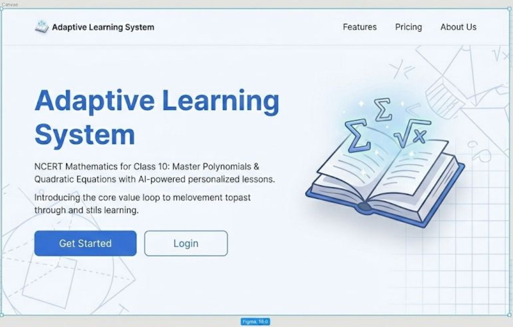
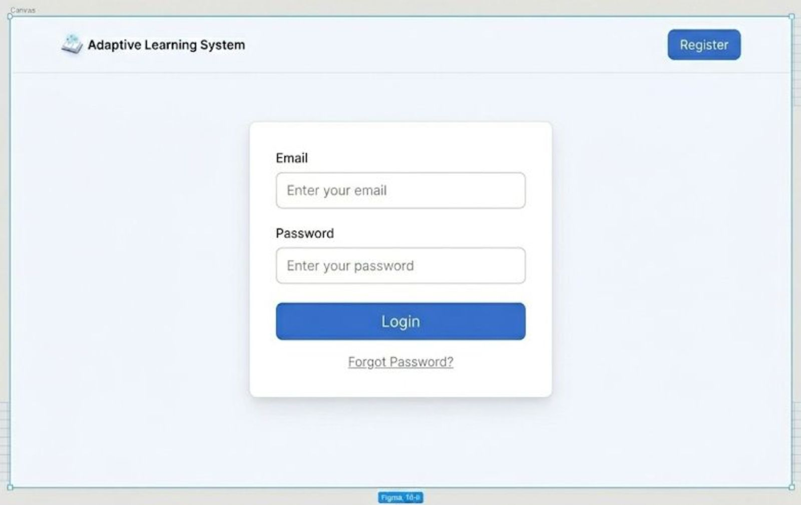
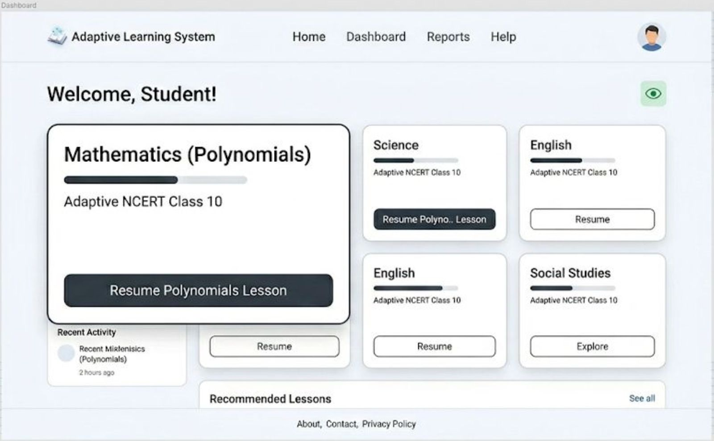
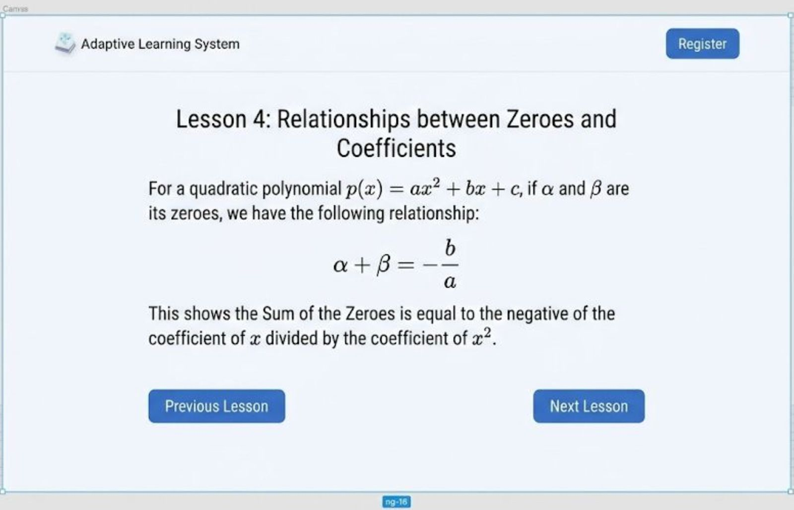
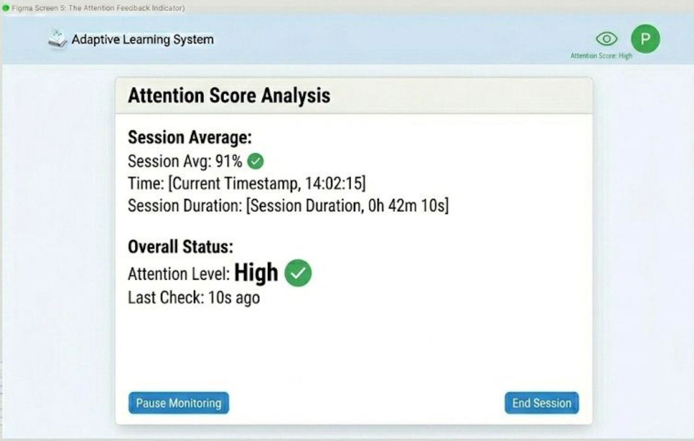
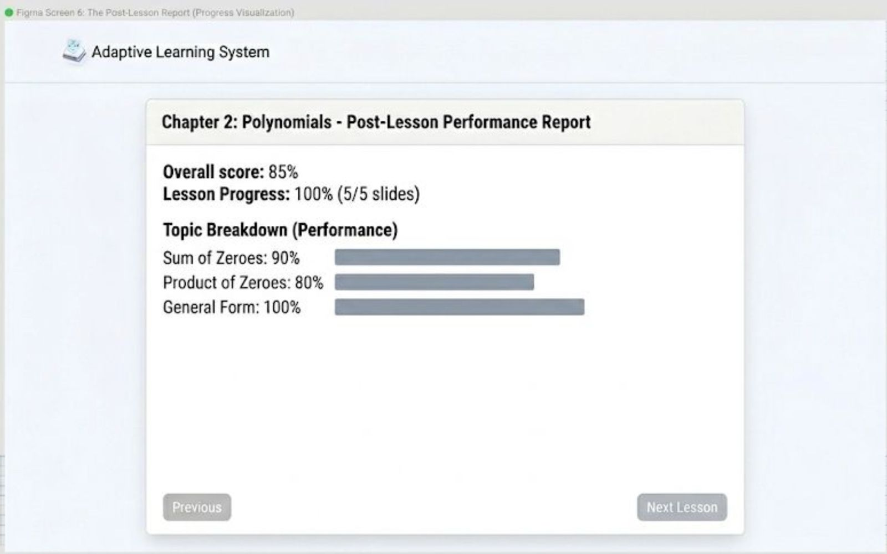

# Vision Document: Web-Based Adaptive Learning System with Attention Monitoring

 

## 1. Project Name & Overview
**Project Name:** Web-Based Adaptive Learning System with Attention Monitoring for School Students

**Overview:**
This project is a web-based application designed to support school students by providing personalized explanations and monitoring engagement during study sessions. Unlike standard video lectures, this system dynamically generates content suitable for the student's standard and adapts explanations based on their performance and real-time attention levels. The system bridges the gap between passive learning and active, guided self-study.

## 2. Problem it Solves
* **Lack of Engagement Monitoring:** Current e-learning systems cannot actively monitor if a student is attentive, leading to unproductive study hours and "zoning out" during video classes.
* **One-Size-Fits-All Content:** Students often encounter explanations that are either too difficult or too easy because teaching styles are not personalized to their grade level or learning speed.
* **Lack of Insight:** Teachers and parents currently have very little knowledge about a student's self-study progress or their actual focus levels during study time.

## 3. Target Users (Personas)
* **Primary User (Students):** School students from different standards who require revision, reinforcement, or alternative explanations for school exams. They need a system that adapts to their pace.
* **Secondary User (Parents & Teachers):** Guardians and educators who need access to learning progress reports and session summaries to understand where the student is struggling.

## 4. Vision Statement
To develop a well-organized learning system that supports students with personalized explanations while simultaneously monitoring student engagement to ensure focused and effective self-study.

## 5. Key Features / Goals
* **Standard & Topic Selection:** Allows students to select their specific school standard (e.g., primary, secondary) and syllabus-based topics.
* **Attention Monitoring (Computer Vision):** Uses webcam-based face and presence detection to ensure student engagement during sessions. If the student looks away or leaves, the system pauses or alerts.
* **Adaptive Content Generation:** Dynamically generates learning content (text/visuals) and adapts re-teaching methods when poor performance or distraction is detected.
* **Voice-Based Explanations:** Provides audio explanations alongside visual materials to cater to auditory learners.
* **Assessment & Tracking:** Includes periodic quizzes to assess understanding and tracks progress across different subjects.

## 6. Technology Stack
*(Proposed stack based on project requirements)*

* **Frontend:** React.js / HTML5, CSS3 (For a responsive web interface)
* **Backend:** Python (Flask/Django) (Required for handling ML logic and request processing)
* **AI/ML Module:** OpenCV & MediaPipe (For real-time face detection and attention tracking)
* **Database:** SQL (MySQL/PostgreSQL) (For storing user profiles, progress, and session data)
* **Deployment:** Docker (For containerization)

## 7. Success Metrics
* **Engagement Detection:** The system successfully detects student presence and basic attention using the webcam with >85% accuracy.
* **Adaptive Response:** Learning content successfully changes format or difficulty based on real-time engagement and quiz results.
* **Improved Outcomes:** Students demonstrate improved understanding through assessments after using the adaptive explanations.
* **Performance:** The system runs smoothly in a standard browser without significant lag during video processing.

## 8. Assumptions & Constraints
**Assumptions:**
* Students have access to a device with a webcam and stable internet connectivity.
* Students and parents consent to webcam-based monitoring for educational purposes.
* School syllabus content can be modularized effectively by standard and subject.

**Constraints:**
* **Hardware:** A webcam is strictly required for the attention monitoring module to function.
* **Accuracy:** Attention tracking is approximate and cannot fully measure deep cognitive understanding.
* **Privacy:** Continuous video storage is limited or disabled due to privacy considerations; only processed metrics are stored.

## 9. Future Roadmap (Optional Features)
* **Difficulty Level Selection:** Allowing students to manually override adaptive settings.
* **Attention Score:** Generating a "Focus Score" per session for gamification.
* **Parental Dashboard:** A dedicated login for parents to view detailed session summaries.
* **Topic Recommendations:** AI-driven suggestions based on past weak areas.

---

## 10. Software Design 

The Adaptive Learning System utilizes a modular, layered client-server architecture that strictly decouples the interactive React frontend from the Python backend to maintain low coupling. By treating the AI-generated lesson content as a strict JSON structure, the backend can safely serve educational artifacts while keeping the biometric attention tracking (MediaPipe) entirely client-side for maximum privacy and low latency.

### Design Assets
All software design files, including editable source diagrams and UI mockups, are located in the [`/docs/design/`](./docs/design/) directory.

#### High-Level Architecture Diagram
*(Editable Source: [Architecture.drawio](./docs/design/Architecture.drawio))*


#### User Interface (Figma Screens)

**Screen 1: Landing Page**


**Screen 2: Authentication Page**


**Screen 3: Student Dashboard**


**Screen 4: AI Lesson Player**


**Screen 5: Attention Feedback Indicator**


**Screen 6: Post-Lesson Report**


---

## 11. Design Summary
The system is built on a decoupled, modular architecture that separates the interactive frontend from the backend to ensure low coupling and high cohesion. Key design choices include utilizing client-side MediaPipe processing to preserve user privacy and reduce server bandwidth, alongside a FAISS-powered Retrieval-Augmented Generation (RAG) pipeline to dynamically serve curriculum-accurate content without the need for expensive model fine-tuning.

## Quick Start – Local Development

### Prerequisites
* Docker Desktop installed
* Git installed

## 🌿 Branching Strategy
We follow **GitHub Flow** for development:
1.  **`main`**: The production-ready code.
2.  **Feature Branches**: Created for every new task (e.g., `feature/login-page`).
3.  **Pull Requests**: Used to merge features back into main.

## 🛠 Local Development Tools
* **Containerization:** Docker Desktop
* **Backend:** Python Flask
* **Frontend:** React (Planned)
* **Editor:** VS Code

## 🚀 Quick Start – Local Development
1.  **Clone the repo:**
    ```bash
    git clone [https://github.com/Abinav-01/ADAPTIVE-LEARNING-SYSTEM.git](https://github.com/Abinav-01/ADAPTIVE-LEARNING-SYSTEM.git)
    ```
2.  **Run with Docker:**
    ```bash
    docker-compose up --build
    ```
3.  **Access App:** Open `http://localhost:5000` in your browser.

---

